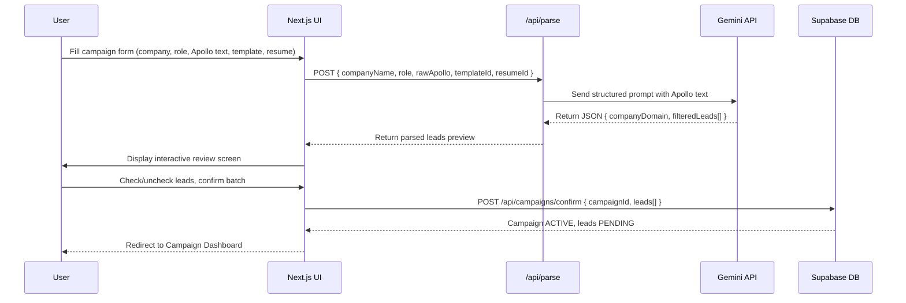

# Design Document: Cold Email & Referral Outreach Automation Platform

## Overview

A full-stack, zero-cost job outreach automation system that converts unstructured corporate employee data (sourced from Apollo.io) into verified, personalized cold emails for internal job referrals. The platform operates on a serverless Next.js architecture with a persistent 5-minute cron queue that enforces safe sending rates (12 emails/hour) to preserve Gmail inbox deliverability and avoid spam detection.

The system guides users through a structured pipeline: campaign creation → AI-powered lead parsing and filtering → interactive lead review → background email dispatch with bounce handling — all orchestrated through Supabase for state persistence and Gemini 1.5 Flash for intelligent data extraction.

## Architecture

```mermaid
graph TD
    subgraph Frontend ["Frontend (Next.js / Vercel)"]
        UI[Campaign Creation UI]
        REVIEW[Lead Review Screen]
        DASH[Campaign Dashboard]
        RESUME[Resume Library Manager]
    end

    subgraph Backend ["Backend (Next.js API Routes)"]
        PARSE[/api/campaigns/parse]
        CONFIRM[/api/campaigns/confirm]
        CTRL[/api/campaigns/control]
        CRON[/api/cron/dispatch]
    end

    subgraph External ["External Services"]
        GEMINI[Gemini 1.5 Flash API]
        GMAIL[Gmail API / Nodemailer]
        CRON_JOB[Cron-Job.org]
    end

    subgraph Data ["Data Layer (Supabase)"]
        DB[(PostgreSQL)]
        STORAGE[(Object Storage)]
    end

    UI -->|Raw Apollo text + config| PARSE
    PARSE -->|Prompt| GEMINI
    GEMINI -->|Filtered leads JSON| PARSE
    PARSE -->|Leads preview| REVIEW
    REVIEW -->|Confirmed leads| CONFIRM
    CONFIRM -->|Insert PENDING leads| DB
    DASH -->|Read campaign state| DB
    DASH -->|pause/resume/cancel| CTRL
    CTRL -->|Update campaign status| DB
    RESUME -->|Upload PDF| STORAGE
    CRON_JOB -->|HTTP trigger every 5 min| CRON
    CRON -->|Query oldest PENDING lead| DB
    CRON -->|Check mailer-daemon bounces| GMAIL
    CRON -->|Send email + attachment| GMAIL
    CRON -->|Update lead status| DB
    DB -->|CDN URL| CRON
    STORAGE -->|CDN stream| GMAIL
```

## Sequence Diagrams

### Campaign Creation Flow



### Cron Dispatch Flow

```mermaid
sequenceDiagram
    participant Cron as Cron-Job.org
    participant API as /api/cron/dispatch
    participant DB as Supabase DB
    participant Gmail as Gmail API
    participant Storage as Supabase Storage

    Cron->>API: GET /api/cron/dispatch (every 5 min)
    API->>Gmail: Query mailer-daemon bounce notifications
    Gmail-->>API: Bounce list (if any)
    API->>DB: Mark bounced leads; try fallback email
    API->>DB: Fetch oldest PENDING lead from ACTIVE campaign
    DB-->>API: Lead record + campaign config
    API->>Storage: Stream resume PDF by CDN URL
    Storage-->>API: PDF buffer
    API->>API: Interpolate template variables
    API->>Gmail: Send email with PDF attachment
    Gmail-->>API: Send confirmation
    API->>DB: Update lead status to SENT, record sentAt
```

## Components and Interfaces

### Component 1: CampaignCreationForm

**Purpose**: Collects all inputs needed to bootstrap an outreach campaign.

**Interface**:
```typescript
interface CampaignFormInput {
  companyName: string        // e.g. "Troopr Labs"
  targetRole: string         // e.g. "Software Development Engineer - 1"
  rawApolloText: string      // Unstructured paste from Apollo.io
  templateId: string         // FK to email_templates table
  resumeId: string           // FK to resumes table
}
```

**Responsibilities**:
- Validate all fields are non-empty before submission
- Stream raw Apollo text to the parse API endpoint
- Display loading state during AI parsing

### Component 2: LeadReviewScreen

**Purpose**: Interactive UI for the user to inspect, approve, or exclude AI-parsed leads before committing to the database.

**Interface**:
```typescript
interface ParsedLead {
  firstName: string
  lastName: string
  role: string
  primaryEmail: string       // firstname@domain.com
  fallbackEmail: string      // firstname.lastname@domain.com
  isVerified: boolean        // true if email found in Apollo source text
  selected: boolean          // user toggle; default true
}

interface LeadReviewProps {
  campaignDraft: CampaignFormInput
  leads: ParsedLead[]
  onConfirm: (selectedLeads: ParsedLead[]) => void
}
```

**Responsibilities**:
- Display all parsed leads in a tabular review UI
- Allow per-lead selection toggle
- Prevent confirmation if zero leads are selected
- Submit confirmed leads to `/api/campaigns/confirm`

### Component 3: CampaignDashboard

**Purpose**: Real-time view of campaign progress with execution controls.

**Interface**:
```typescript
interface CampaignStatus = 'ACTIVE' | 'PAUSED' | 'COMPLETED' | 'CANCELLED'
interface LeadStatus = 'PENDING' | 'SENT' | 'FAILED_BOUNCED' | 'SKIPPED'

interface Campaign {
  id: string
  companyName: string
  targetRole: string
  status: CampaignStatus
  createdAt: string
  leads: Lead[]
}

interface Lead {
  id: string
  campaignId: string
  firstName: string
  lastName: string
  role: string
  primaryEmail: string
  fallbackEmail: string
  isVerified: boolean
  status: LeadStatus
  sentAt: string | null
  failureReason: string | null
}
```

**Responsibilities**:
- Poll or subscribe to campaign state from Supabase
- Render per-lead status (PENDING / SENT / FAILED_BOUNCED)
- Expose Pause, Resume, Cancel control buttons
- Show overall campaign progress (sent / total)

### Component 4: ResumeLibraryManager

**Purpose**: Manages upload, labeling, and selection of PDF resumes used as email attachments.

**Interface**:
```typescript
interface Resume {
  id: string
  label: string              // e.g. "MERN_AI_SaaS_Resume"
  fileName: string
  cdnUrl: string             // Supabase Storage public CDN URL
  uploadedAt: string
}
```

**Responsibilities**:
- Accept PDF file uploads and persist to Supabase Storage
- Store metadata (label, cdnUrl) in the `resumes` table
- Allow resume selection during campaign creation

### Component 5: GeminiParserService

**Purpose**: Server-side service that formats and sends the LLM prompt, then parses and validates the JSON response.

**Interface**:
```typescript
interface GeminiParseRequest {
  companyName: string
  targetRole: string
  rawApolloText: string
}

interface GeminiParseResponse {
  companyDomain: string
  filteredLeads: ParsedLead[]
}

async function parseApolloData(req: GeminiParseRequest): Promise<GeminiParseResponse>
```

**Preconditions**:
- `rawApolloText` is non-empty
- Gemini API key is available in environment

**Postconditions**:
- Returns valid JSON matching `GeminiParseResponse` schema
- `filteredLeads` contains only technical/hiring roles
- Each lead has `primaryEmail` and `fallbackEmail` set
- If Gemini returns malformed JSON, throws `ParseError`

### Component 6: CronDispatchService

**Purpose**: Serverless function triggered every 5 minutes that executes one email send cycle.

**Interface**:
```typescript
interface DispatchResult {
  leadId: string
  status: 'SENT' | 'FAILED_BOUNCED' | 'SKIPPED' | 'NO_PENDING'
  sentTo?: string
  error?: string
}

async function runDispatchCycle(): Promise<DispatchResult>
```

**Preconditions**:
- At least one campaign is in ACTIVE status
- Gmail API credentials are valid

**Postconditions**:
- At most one email is sent per invocation
- Lead status is updated in Supabase after send attempt
- Bounced leads trigger fallback email attempt before FAILED_BOUNCED
- No email sent if no ACTIVE campaign or no PENDING leads

**Loop Invariants** (per cron cycle):
- Exactly one PENDING lead is transitioned per successful dispatch
- Campaign remains ACTIVE unless explicitly paused/cancelled

## Data Models

### Model 1: campaigns

```typescript
interface Campaign {
  id: string                   // UUID, primary key
  companyName: string          // Target company name
  targetRole: string           // Job role being applied for
  templateId: string           // FK → email_templates.id
  resumeId: string             // FK → resumes.id
  companyDomain: string        // Extracted by Gemini (e.g. "troopr.ai")
  status: CampaignStatus       // ACTIVE | PAUSED | COMPLETED | CANCELLED
  createdAt: string            // ISO timestamp
  updatedAt: string            // ISO timestamp
}
```

**Validation Rules**:
- `companyName` and `targetRole` must be non-empty strings
- `status` must be one of the four defined enum values
- `templateId` and `resumeId` must reference existing records

### Model 2: leads

```typescript
interface Lead {
  id: string                   // UUID, primary key
  campaignId: string           // FK → campaigns.id
  firstName: string
  lastName: string
  role: string                 // Employee's title as parsed
  primaryEmail: string         // firstname@domain.com
  fallbackEmail: string        // firstname.lastname@domain.com
  isVerified: boolean          // Apollo had explicit email
  status: LeadStatus           // PENDING | SENT | FAILED_BOUNCED | SKIPPED
  sentAt: string | null        // ISO timestamp of send
  failureReason: string | null // Bounce message or error detail
  createdAt: string
}
```

**Validation Rules**:
- `primaryEmail` and `fallbackEmail` must be valid email format
- `status` transitions: PENDING → SENT | FAILED_BOUNCED | SKIPPED
- `sentAt` must be set when status becomes SENT
- `failureReason` must be set when status becomes FAILED_BOUNCED

### Model 3: resumes

```typescript
interface Resume {
  id: string                   // UUID, primary key
  label: string                // User-assigned label (e.g. "MERN_AI_SaaS_Resume")
  fileName: string             // Original file name
  cdnUrl: string               // Supabase Storage CDN URL
  uploadedAt: string           // ISO timestamp
}
```

**Validation Rules**:
- `cdnUrl` must be a valid HTTPS URL pointing to Supabase Storage
- `label` must be non-empty and unique per user
- File must be PDF format

### Model 4: email_templates

```typescript
interface EmailTemplate {
  id: string                   // UUID, primary key
  name: string                 // e.g. "Standard Referral"
  subjectTemplate: string      // e.g. "Quick Referral Inquiry - {role} at {company_name}"
  bodyTemplate: string         // HTML/text with interpolation variables
  variables: string[]          // List of required variables e.g. ["role", "company_name", "firstName"]
  createdAt: string
}
```

**Validation Rules**:
- All variables listed in `variables` must appear in `subjectTemplate` or `bodyTemplate`
- `subjectTemplate` and `bodyTemplate` must be non-empty
- Variables use `{variableName}` syntax

## Key Functions with Formal Specifications

### Function 1: parseApolloData()

```typescript
async function parseApolloData(req: GeminiParseRequest): Promise<GeminiParseResponse>
```

**Preconditions**:
- `req.rawApolloText.trim().length > 0`
- `req.companyName.trim().length > 0`
- `req.targetRole.trim().length > 0`
- Gemini API key is set in environment

**Postconditions**:
- Returns `GeminiParseResponse` with valid `companyDomain` (non-empty string)
- All entries in `filteredLeads` have non-empty `firstName`, `lastName`, `primaryEmail`, `fallbackEmail`
- `primaryEmail` matches pattern `firstname@companyDomain`
- `fallbackEmail` matches pattern `firstname.lastname@companyDomain`
- Only technical or hiring-related roles are included

**Loop Invariants**: N/A (single LLM call)

### Function 2: interpolateTemplate()

```typescript
function interpolateTemplate(template: string, variables: Record<string, string>): string
```

**Preconditions**:
- `template` is a non-empty string
- All `{variableName}` placeholders in `template` have a corresponding key in `variables`

**Postconditions**:
- Returns string with all `{variableName}` tokens replaced by their values
- No unreplaced `{...}` tokens remain in output
- If any variable is missing, throws `InterpolationError` before sending

**Loop Invariants**:
- For each placeholder found: it is replaced exactly once

### Function 3: runDispatchCycle()

```typescript
async function runDispatchCycle(): Promise<DispatchResult>
```

**Preconditions**:
- Called at most once per 5-minute window (enforced by Cron-Job.org)
- Gmail API credentials are valid

**Postconditions**:
- If no ACTIVE campaign exists: returns `{ status: 'NO_PENDING' }`
- If PENDING lead exists: lead is emailed and status updated to SENT
- If send fails with bounce: fallback email is attempted before FAILED_BOUNCED
- Database state is consistent after function returns (no orphaned PENDING on success path)

### Function 4: handleBounce()

```typescript
async function handleBounce(lead: Lead): Promise<LeadStatus>
```

**Preconditions**:
- `lead.status === 'SENT'`
- Bounce notification matched to `lead.primaryEmail`

**Postconditions**:
- If fallback email not yet tried: send to `fallbackEmail`, return 'SENT'
- If fallback also bounces or was already tried: update to 'FAILED_BOUNCED'
- `failureReason` field is populated in both failure cases

## Algorithmic Pseudocode

### Main Processing Algorithm: Campaign Creation Pipeline

```typescript
async function createCampaign(input: CampaignFormInput): Promise<Campaign> {
  // Phase 1: Validate all inputs
  validateNonEmpty(input.companyName, input.targetRole, input.rawApolloText)
  assertExists(resumes, input.resumeId)
  assertExists(templates, input.templateId)

  // Phase 2: AI Parsing
  const parsed = await parseApolloData({
    companyName: input.companyName,
    targetRole: input.targetRole,
    rawApolloText: input.rawApolloText
  })
  // parsed.filteredLeads[] ready for review

  // Phase 3: User Review (handled by UI — confirm endpoint)

  // Phase 4: Persist to DB (called from /api/campaigns/confirm)
  const campaign = await db.campaigns.insert({
    ...input,
    companyDomain: parsed.companyDomain,
    status: 'ACTIVE'
  })
  for (const lead of confirmedLeads) {
    await db.leads.insert({ ...lead, campaignId: campaign.id, status: 'PENDING' })
  }

  return campaign
}
```

### Cron Dispatch Algorithm

```typescript
async function runDispatchCycle(): Promise<DispatchResult> {
  // Step 1: Check bounces first
  const bounceNotifications = await gmail.queryMailerDaemon({ since: lastCronRun })
  for (const bounce of bounceNotifications) {
    const lead = await db.leads.findByEmail(bounce.recipientEmail)
    if (lead) await handleBounce(lead)
  }

  // Step 2: Find oldest PENDING lead from ACTIVE campaign
  const activeCampaign = await db.campaigns.findFirst({ status: 'ACTIVE' })
  if (!activeCampaign) return { status: 'NO_PENDING' }

  const lead = await db.leads.findFirst({
    campaignId: activeCampaign.id,
    status: 'PENDING',
    orderBy: 'createdAt ASC'
  })
  if (!lead) {
    await db.campaigns.update(activeCampaign.id, { status: 'COMPLETED' })
    return { status: 'NO_PENDING' }
  }

  // Step 3: Build email
  const template = await db.templates.findById(activeCampaign.templateId)
  const resume = await db.resumes.findById(activeCampaign.resumeId)
  const subject = interpolateTemplate(template.subjectTemplate, {
    role: activeCampaign.targetRole,
    company_name: activeCampaign.companyName,
    firstName: lead.firstName
  })
  const body = interpolateTemplate(template.bodyTemplate, {
    role: activeCampaign.targetRole,
    company_name: activeCampaign.companyName,
    firstName: lead.firstName
  })

  // Step 4: Send email
  const pdfBuffer = await fetch(resume.cdnUrl).then(r => r.arrayBuffer())
  await gmail.send({
    to: lead.primaryEmail,
    subject,
    body,
    attachments: [{ filename: resume.fileName, content: pdfBuffer }]
  })

  // Step 5: Update lead status
  await db.leads.update(lead.id, { status: 'SENT', sentAt: new Date().toISOString() })

  return { leadId: lead.id, status: 'SENT', sentTo: lead.primaryEmail }
}
```

### Template Interpolation Algorithm

```typescript
function interpolateTemplate(template: string, variables: Record<string, string>): string {
  // Find all {variableName} tokens
  const tokens = extractTokens(template)   // returns string[]

  // Validate all tokens have values — fail fast before send
  for (const token of tokens) {
    if (variables[token] === undefined) {
      throw new InterpolationError(`Missing variable: ${token}`)
    }
  }

  // Replace each token exactly once
  let result = template
  for (const [key, value] of Object.entries(variables)) {
    result = result.replaceAll(`{${key}}`, value)
  }

  // Postcondition: no unreplaced tokens
  if (/\{[a-zA-Z_]+\}/.test(result)) {
    throw new InterpolationError('Unreplaced tokens remain after interpolation')
  }

  return result
}
```

## Example Usage

```typescript
// Example 1: Create a new campaign
const campaign = await createCampaign({
  companyName: "Troopr Labs",
  targetRole: "Software Development Engineer - 1",
  rawApolloText: "<pasted Apollo.io employee list>",
  templateId: "tmpl_standard_referral",
  resumeId: "res_mern_ai_saas"
})
// Returns campaign with status ACTIVE and N leads as PENDING

// Example 2: Template interpolation
const subject = interpolateTemplate(
  "Quick Referral Inquiry - {role} at {company_name}",
  { role: "SDE-1", company_name: "Troopr Labs", firstName: "Riya" }
)
// Returns: "Quick Referral Inquiry - SDE-1 at Troopr Labs"

// Example 3: Cron dispatch
const result = await runDispatchCycle()
// Returns: { leadId: "...", status: "SENT", sentTo: "riya@troopr.ai" }

// Example 4: Bounce handling
const bounceResult = await handleBounce(sentLead)
// If primaryEmail bounced → tries fallbackEmail → returns 'SENT' or 'FAILED_BOUNCED'
```

## Error Handling

### Error Scenario 1: Gemini Returns Malformed JSON

**Condition**: Gemini API response cannot be parsed as valid JSON matching `GeminiParseResponse`
**Response**: Throw `ParseError` with original response text; surface to user as "AI parsing failed — please try again"
**Recovery**: User retries campaign creation; no DB state written

### Error Scenario 2: Template Variable Missing at Send Time

**Condition**: `interpolateTemplate()` detects an unreplaced `{token}` in subject or body
**Response**: Throw `InterpolationError`; lead remains PENDING; cron cycle skips this lead and logs error
**Recovery**: Admin fixes template; next cron cycle reattempts lead

### Error Scenario 3: Email Bounce (Primary Email)

**Condition**: Gmail API detects mailer-daemon notification for a SENT lead's `primaryEmail`
**Response**: Attempt send to `fallbackEmail`
**Recovery**: If fallback succeeds → status SENT. If fallback also bounces → status FAILED_BOUNCED with `failureReason`

### Error Scenario 4: Gmail API Send Failure (Non-Bounce)

**Condition**: Gmail API throws network/auth error during send
**Response**: Lead remains PENDING; cron logs error and exits cycle
**Recovery**: Next 5-minute cron cycle retries the same lead

### Error Scenario 5: Resume PDF Unavailable

**Condition**: Supabase Storage CDN URL returns non-200 for PDF fetch
**Response**: Cron cycle aborts send; lead remains PENDING; error logged
**Recovery**: User re-uploads resume or updates campaign resume selection

### Error Scenario 6: Campaign Paused Mid-Queue

**Condition**: User clicks Pause while leads are PENDING
**Response**: Campaign status set to PAUSED; cron checks campaign status before each send and skips if PAUSED
**Recovery**: User clicks Resume; cron resumes from next oldest PENDING lead

## Testing Strategy

### Unit Testing Approach

Unit tests cover pure functions: `interpolateTemplate`, Gemini response validation, lead status transitions, and email address pattern construction. Each test verifies specific examples and edge cases using Jest (built into Next.js).

Key unit test scenarios:
- `interpolateTemplate` with all variables present → correct output
- `interpolateTemplate` with missing variable → throws `InterpolationError`
- `interpolateTemplate` with empty template → returns empty string
- Gemini JSON schema validation with valid and malformed inputs
- Email pattern: `firstname@domain` construction from first/last name

### Property-Based Testing Approach

**Property Test Library**: fast-check (TypeScript/JavaScript)

Property tests validate universal invariants that must hold across all inputs:

- **Round-trip interpolation**: For any template with variables, interpolating then extracting variable positions yields the original structure
- **Lead status monotonicity**: A lead's status can only advance (PENDING → SENT/FAILED_BOUNCED), never regress
- **Template completeness**: For any template, all declared `variables` appear in the rendered output after interpolation
- **Email pattern consistency**: For any first/last name pair and domain, `primaryEmail` always matches `{firstName}@{domain}` and `fallbackEmail` matches `{firstName}.{lastName}@{domain}`

### Integration Testing Approach

Integration tests use a Supabase test database and mocked Gmail/Gemini clients:

- Full campaign creation flow (form → parse → review → confirm → PENDING leads in DB)
- Cron dispatch cycle: PENDING → SENT transition with mocked Gmail send
- Bounce handling: SENT → FAILED_BOUNCED with mocked mailer-daemon response
- Campaign control: ACTIVE → PAUSED → ACTIVE state machine via control API

## Performance Considerations

- **Sending velocity**: Hard cap of 1 email per 5-minute cron execution (12/hour) enforced by Cron-Job.org schedule, protecting Gmail sender reputation
- **Supabase queries**: All lead queries use indexed `(campaignId, status, createdAt)` for O(log n) oldest-PENDING lookup
- **PDF streaming**: Resume PDF fetched via CDN URL at send time rather than stored in memory, keeping the serverless function memory footprint low
- **Stateless cron**: Each cron invocation is fully stateless; all state lives in Supabase, enabling safe concurrent-safe reads with row-level locking on lead status transitions

## Security Considerations

- **Gmail credentials**: Stored as Vercel environment variables (never in source); OAuth2 refresh tokens preferred over App Passwords
- **Gemini API key**: Server-side only; never exposed to client bundle
- **Supabase RLS**: Row Level Security policies ensure users can only read/write their own campaigns and leads
- **CRON_SECRET**: The `/api/cron/dispatch` endpoint validates a shared secret header (`Authorization: Bearer {CRON_SECRET}`) to prevent unauthorized invocation
- **Input sanitization**: `rawApolloText` is passed to Gemini as data, not executed; LLM prompt is structured to prevent prompt injection
- **PDF validation**: File type checked on upload; only `application/pdf` MIME type accepted

## Dependencies

| Dependency | Version | Purpose |
|---|---|---|
| next | ^14 | Full-stack React framework |
| @supabase/supabase-js | ^2 | Database client + Storage |
| @google/generative-ai | ^0.7 | Gemini 1.5 Flash API |
| nodemailer | ^6 | Email dispatch |
| googleapis | ^140 | Gmail API + OAuth2 |
| fast-check | ^3 | Property-based testing |
| jest | ^29 | Unit test runner |
| tailwindcss | ^3 | Utility-first CSS |
| zod | ^3 | Runtime schema validation |

## Correctness Properties

*A property is a characteristic or behavior that should hold true across all valid executions of a system — essentially, a formal statement about what the system should do. Properties serve as the bridge between human-readable specifications and machine-verifiable correctness guarantees.*

### Property 1: Campaign Creation Requires All Fields

*For any* campaign creation form submission, the system SHALL reject the submission if and only if at least one required field (`companyName`, `targetRole`, `rawApolloText`, `templateId`, `resumeId`) is empty or missing.

**Validates: Requirements 1.1, 1.2**

### Property 2: Confirmed Leads Are Persisted as PENDING

*For any* confirmed batch of leads, after the confirmation endpoint completes successfully, every lead in the batch SHALL have `status: PENDING` in the database and the parent campaign SHALL have `status: ACTIVE`.

**Validates: Requirements 1.4**

### Property 3: Campaign Has Exactly One Resume and Template

*For any* campaign record in the database, the campaign SHALL have exactly one non-null `resumeId` and one non-null `templateId` that reference existing records.

**Validates: Requirements 1.5**

### Property 4: Gemini Response Schema Validation

*For any* string returned by the Gemini API, the Parser SHALL accept it if and only if it is valid JSON that matches the `GeminiParseResponse` schema (containing a non-empty `companyDomain` string and a `filteredLeads` array with valid lead objects). Any string that does not meet this schema SHALL cause a `ParseError` to be thrown with no database writes.

**Validates: Requirements 2.2, 2.3**

### Property 5: Email Address Pattern Consistency

*For any* first name, last name, and company domain, the constructed `primaryEmail` SHALL equal `{firstName.toLowerCase()}@{companyDomain}` and `fallbackEmail` SHALL equal `{firstName.toLowerCase()}.{lastName.toLowerCase()}@{companyDomain}`.

**Validates: Requirements 2.5, 12.3**

### Property 6: Lead Review Defaults All Leads to Selected

*For any* list of parsed leads returned by the Parser, the Lead Review UI SHALL initialize every lead with `selected: true`.

**Validates: Requirements 3.2**

### Property 7: Only Selected Leads Are Confirmed

*For any* set of leads displayed in the review screen with any combination of selected/deselected states, the confirmation payload SHALL contain exactly the subset of leads where `selected === true`. If the selected subset is empty, confirmation SHALL be blocked.

**Validates: Requirements 3.3, 3.4, 3.5**

### Property 8: PDF Upload MIME Type Enforcement

*For any* file upload to the Resume Library, the system SHALL accept the file if and only if its MIME type is `application/pdf`. All other MIME types SHALL be rejected with a validation error.

**Validates: Requirements 4.1, 4.2, 11.3**

### Property 9: Template Variable Completeness

*For any* email template, every key listed in the `variables` array SHALL appear at least once in `subjectTemplate` or `bodyTemplate`, and every `{token}` present in `subjectTemplate` or `bodyTemplate` SHALL be declared in the `variables` array.

**Validates: Requirements 5.3, 5.4**

### Property 10: Template Interpolation Completeness

*For any* template string and any mapping of variable names to string values where all tokens in the template are present in the mapping, the `interpolateTemplate` function SHALL return a string with no remaining `{...}` tokens, where every occurrence of `{variableName}` has been replaced by its corresponding value.

**Validates: Requirements 6.1, 6.3**

### Property 11: Interpolation Error on Missing Variable

*For any* template string that contains a `{variableName}` token where `variableName` is absent from the provided variables map, the `interpolateTemplate` function SHALL throw an `InterpolationError` and SHALL NOT produce a partial output.

**Validates: Requirements 6.2**

### Property 12: Interpolation Idempotence (Pure Function)

*For any* template string and variables map, calling `interpolateTemplate(template, variables)` twice with identical arguments SHALL produce the same output string, with no observable side effects on either argument.

**Validates: Requirements 6.4**

### Property 13: Cron Authentication Enforcement

*For any* HTTP request to `/api/cron/dispatch`, the Cron_Service SHALL return HTTP 200 and proceed with dispatch if and only if the `Authorization` header contains `Bearer {CRON_SECRET}`. All other requests SHALL receive HTTP 401 with no email dispatch or database writes.

**Validates: Requirements 7.2, 7.3**

### Property 14: At Most One Email Per Cron Invocation

*For any* single invocation of the Cron_Service, the number of emails sent SHALL be exactly 0 or 1. It SHALL never exceed 1 regardless of how many PENDING leads exist.

**Validates: Requirements 7.4**

### Property 15: Oldest PENDING Lead Selected First

*For any* set of PENDING leads within an ACTIVE campaign, the Cron_Service SHALL select the lead with the smallest `createdAt` timestamp (oldest first) for the next send.

**Validates: Requirements 7.5**

### Property 16: Campaign Completes When All Leads Are Processed

*For any* ACTIVE campaign where every lead has a non-PENDING status (SENT, FAILED_BOUNCED, or SKIPPED), the Cron_Service SHALL transition the campaign status to `COMPLETED` on the next invocation.

**Validates: Requirements 7.7**

### Property 17: Paused Campaign Skips All Sends

*For any* campaign with `status: PAUSED`, the Cron_Service SHALL not send any emails to leads belonging to that campaign, regardless of how many PENDING leads exist.

**Validates: Requirements 7.8**

### Property 18: Successful Send Updates Lead Status and Timestamp

*For any* lead for which the Gmail_Service successfully sends an email, the lead's `status` SHALL be updated to `SENT` and `sentAt` SHALL be set to the current UTC timestamp. No lead SHALL have `status: SENT` with a null `sentAt`.

**Validates: Requirements 8.2**

### Property 19: CDN Failure Preserves Lead as PENDING

*For any* lead where the resume CDN URL returns a non-200 HTTP response, the lead's status SHALL remain `PENDING` after the cron cycle completes. No partial email SHALL be sent.

**Validates: Requirements 8.3**

### Property 20: Bounce Triggers Fallback Resend

*For any* lead whose `primaryEmail` has produced a bounce notification, the system SHALL attempt to send the email to that lead's `fallbackEmail`. If the fallback send succeeds, the lead status SHALL be `SENT`. If the fallback also bounces, the lead status SHALL be `FAILED_BOUNCED` with a non-empty `failureReason`.

**Validates: Requirements 9.2, 9.3**

### Property 21: Campaign Pause/Resume Round-Trip

*For any* ACTIVE campaign, after a Pause action followed by a Resume action, the campaign status SHALL be `ACTIVE` and all previously PENDING leads SHALL remain PENDING (no leads lost or altered during the pause/resume cycle).

**Validates: Requirements 10.3, 10.4**

### Property 22: Terminal Campaign State Is Read-Only

*For any* campaign with `status: COMPLETED` or `status: CANCELLED`, the system SHALL not expose Pause, Resume, or Cancel control actions, and the lead statuses SHALL not be mutable through the dashboard UI.

**Validates: Requirements 10.6**

### Property 23: GeminiParseResponse Serialization Round-Trip

*For any* valid `GeminiParseResponse` object, serializing it to a JSON string and then deserializing the resulting string SHALL produce an object that is deep-equal to the original (same `companyDomain` and identical `filteredLeads` array with all fields preserved).

**Validates: Requirements 12.1, 12.2**
